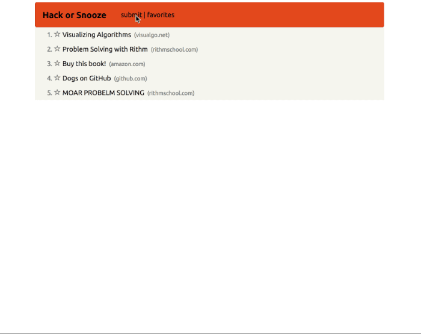

## jQuery Exercise

Your task in this exercise is to build a simple clone of [Hacker News](https://news.ycombinator.com/) using jQuery. Here's a quick GIF showcasing the functionality (explicit requirements are below):

__Requirements__

* Users should be able to toggle a form used to add a new story.
  <!-- the submit button should toggle a submit FORM 
    can make submit a button or just text on a nav bar
    add event listener on click to toggle
    could use a toggle method from jquery-->
  <!-- bootstrap has collapse method built in! -->
  <!-- once in the form you can submit a new story
  might need to use prevent Default
  need to grab a value from form 
  append these values to an ordered list using jQuery
  -->
* After submitting the form, the story should be added to the list of stories.
  <!-- might need to use prevent Default
  need to grab a value from form  -->
<!-- append values from form to an ordered list-->
<!-- can use jQuery and append to div and style -->
* If the URL entered in the form is invalid, the browser should prompt the user to enter a valid url.
<!-- this should be a short code, I've used it before in meme generator -->
* Users can click on a star next to a story to mark it as a "favorite."
<!-- look up how to style, use an event listener for clicks
    toggle between favorite and unfav
    possiblity have a class toggle -->
* Style your app! 
<!-- bootstrap/css -->

__BONUS__

* Users can click on a "favorites" option in the nav bar to show only stories that they have favorited. Clicking on it again shows all stories.
<!-- add event listener when clicking on  favorites to only show favorite class
hide  -->
* In addition to displaying the title of each story, display the hostname for the corresponding URL. When users click on the hostname, all stories with different hostnames are filtered out (compare to the same functionality on Hacker News).
<!-- would prob need to use window.location.host and filter out all of that -->

Good luck!